<!--
  SOURCE DOCUMENT — Markdown master for the SysManage Executive Overview.
  Built to DOCX + PDF via scripts/build-marketing-brief.py. See marketing/README.md.

  Conventions:
    - [FIGURE: ...] comments mark image slots; images live under images/.
    - <!-- PAGEBREAK --> becomes a real page break at build time.
    - > **LABEL** — blockquotes render as styled callout boxes.
    - Third-party trademark symbols are applied automatically at build time,
      except inside <!-- NO-TM-START --> ... <!-- NO-TM-END --> regions.
    - Voice: professional third person throughout; first person only in the
      clearly personal sections (Founder, The Ask).
-->

<!-- COVER PAGE -->

# SysManage

## A Unified Control Plane for Heterogeneous Enterprise Infrastructure

**Executive Overview**

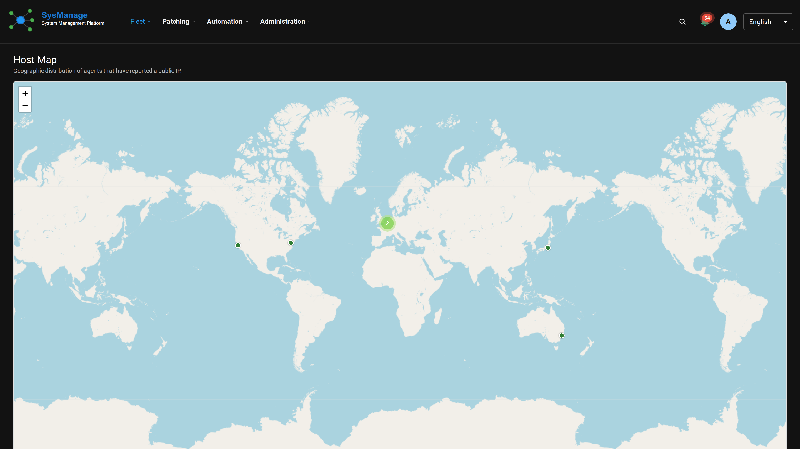

*Confidential — prepared for discussion with prospective customers, design partners, strategic and channel partners, executive sales leadership, and investors.*

*© 2026 Bryan Everly. All rights reserved.*

<!-- PAGEBREAK -->

## Executive Summary

Enterprise infrastructure has become fundamentally more complex over the past decade. Windows, Linux, macOS, cloud workloads, virtualization, appliances, and increasingly specialized operating systems now coexist inside the same organization, and the number of tools required to manage them has grown alongside them.

Existing management software evolved around individual operating systems rather than around heterogeneous infrastructure. Endpoint management, vulnerability management, compliance, automation, patching, and reporting are typically delivered by different vendors, each optimized for a single platform. The result is a fragmented, costly, and difficult-to-secure operational environment: multiple consoles, multiple licenses, and no single source of truth.

SysManage was built to solve that problem. It treats infrastructure as a unified fleet rather than a collection of separate operating systems, providing a single control plane that manages Linux, Windows, macOS, FreeBSD, OpenBSD, and NetBSD and consolidates the operational, security, compliance, and lifecycle capabilities teams rely on into one consistent experience.

The platform ships as an open-source Community Edition. The Professional, Enterprise, and Enterprise SaaS tiers add AI-assisted operations, deeper security and compliance, multi-tenancy, and air-gapped deployment.

The opportunity has already been reviewed by an established European venture capital firm founded by experienced enterprise software executives. Their assessment of both the technology and the market was positive, and their primary recommendation was to strengthen the leadership team with an experienced enterprise software sales executive capable of accelerating commercial adoption. The product and its documentation already ship in fourteen languages, positioning the platform for global adoption from its earliest commercial stages.

> **CORE THESIS** — Infrastructure teams manage fleets, not operating systems. To the best of our knowledge, no commercially available platform offers first-class lifecycle, patch, compliance, vulnerability, automation, and administration across Linux, Windows, macOS, FreeBSD, OpenBSD, and NetBSD from a single control plane.

This document outlines the market, why existing tools fall short, why customers buy, how the business will be built, the founder behind it, the principal risks, and the relationships now being sought.

<!-- PAGEBREAK -->

## The Infrastructure Management Problem

Enterprise infrastructure has changed fundamentally over the past twenty years. Organizations once operated relatively uniform environments: Windows administrators managed Windows, Unix administrators managed Unix, and desktop and server management were separate disciplines. That distinction has disappeared.

A typical enterprise today may simultaneously operate:

- Windows desktops and servers
- Linux servers across several distributions
- macOS developer workstations
- Cloud-native and containerized workloads
- Virtualization and hypervisor infrastructure
- Network, storage, and security appliances
- FreeBSD, OpenBSD, and NetBSD systems
- Air-gapped environments and remote offices

Each platform tends to demand its own tooling, so organizations assemble an operational toolchain out of point products:

<!-- [FIGURE: "before" diagram — each OS wired to a different single-purpose tool, tangled. images/problem-fragmented.png] -->

| Operating system / function | Typical point product(s) |
|---|---|
| Windows | Microsoft Intune, Configuration Manager (MECM/SCCM) |
| macOS / Apple | Jamf |
| Red Hat Enterprise Linux | Red Hat Satellite |
| Ubuntu | Canonical Landscape |
| SUSE Linux Enterprise | SUSE Manager |
| FreeBSD / OpenBSD / NetBSD | Often custom scripts, or no commercial platform at all |
| Vulnerability management | Qualys, Rapid7, Tenable |
| Patch management | Automox, Action1, BigFix |
| Endpoint / cross-platform ops | Tanium, NinjaOne, ConnectWise, Datto RMM |
| Automation | Ansible and adjacent tooling |
| Compliance & reporting | Separate GRC / assessment tools |

Each of these is excellent at its particular job. None manages the heterogeneous environment as a single system. As a result, teams spend a significant share of their time integrating products that were never designed to work together, and increasingly find themselves managing software rather than managing infrastructure.

<!-- PAGEBREAK -->

## Why Existing Solutions Fall Short

This is not a criticism of the incumbents. Each optimized for the platform central to its business, and most did so extremely well. The difficulty appears only when those products have to operate together. Four problems recur.

**Fragmented visibility.** The answer to a single question is spread across several consoles. To understand the state of one system, an administrator moves from product to product.

**Operational complexity and cost.** Every product brings its own deployment model, upgrade cycle, security model, API, and contract. Tooling that was meant to reduce the operational burden frequently adds to it.

**Inconsistent security.** When Windows and Linux are managed by different products, security teams struggle to produce one coherent picture. Compliance frameworks do not distinguish between operating systems, and neither do attackers. Operational visibility should not either.

**Uneven platform support.** FreeBSD, OpenBSD, and NetBSD are widely deployed across networking, storage, telecommunications, hosting, research, and security, yet they receive little attention from mainstream vendors. Organizations running them are left to build custom tooling or accept reduced visibility.

Microsoft optimizes Windows. Jamf optimizes Apple. Red Hat optimizes RHEL. Canonical optimizes Ubuntu. Each is best-in-class within its domain. None optimizes all of them, and that gap is the opportunity.

<!-- PAGEBREAK -->

## The SysManage Vision — A Unified Control Plane

SysManage begins with a simple observation: infrastructure teams manage fleets, not operating systems. Every managed system raises the same core questions regardless of the platform beneath it. What is installed on it? Is it vulnerable? Is it compliant? Does it need updating? What changed, and who changed it? Can it be automated, secured, and reported on? Those questions do not change when the operating system changes, and the product is built around the questions rather than the operating systems.

The objective is straightforward: a single control plane capable of running a heterogeneous fleet through one consistent experience.

<!-- [FIGURE: "after" diagram — six OSes (Linux, Windows, macOS, FreeBSD, OpenBSD, NetBSD) converging into one SysManage control plane. images/vision-unified.png] -->

The phrase "single pane of glass" has been deliberately set aside; it has become a cliché. "Unified control plane" is the more accurate description: the place from which a heterogeneous fleet is administered, secured, and reported on as one environment.

## Why Now

Several long-term trends are converging to make this the right moment for a platform of this kind.

**Infrastructure diversity.** Enterprise environments continue to become more heterogeneous, not less. The number of operating systems under management rises every year.

**Cybersecurity as an operational discipline.** Inventory, patching, vulnerability management, and compliance are now foundational security controls rather than routine housekeeping. Operational and security tooling continue to converge.

**Vendor consolidation.** Organizations are actively reducing the number of vendors they manage, lowering licensing spend and reducing training and integration overhead.

**Staffing constraints.** Teams are expected to manage larger environments with fewer people. Automation is no longer optional.

**Artificial intelligence.** AI allows administrators to manage substantially larger fleets, but only when it can see the whole environment. Its value is greatest when it operates against a complete, unified model rather than a series of isolated consoles, an advantage that accrues directly to a unified control plane.

<!-- PAGEBREAK -->

## Market Opportunity

SysManage does not occupy a single narrowly defined category. It sits where several of the largest enterprise-software markets overlap: endpoint management, IT operations, vulnerability management, patch management, compliance, and infrastructure automation, with managed services as an adjacent delivery channel.

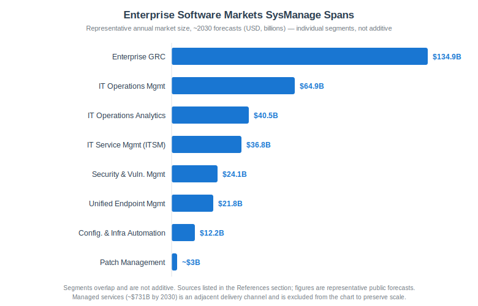

These categories overlap and should not be summed into a single total addressable market. Presented individually, however, they establish the scale of enterprise investment surrounding the disciplines SysManage unifies:

| Market segment | Representative size / forecast | Source |
|---|---|---|
| Enterprise Governance, Risk & Compliance (eGRC) | ~$134.9B by 2030 (13.2% CAGR) | Grand View Research |
| IT Operations Management | ~$64.9B by 2030 (12.3% CAGR) | Mordor Intelligence |
| IT Operations Analytics | ~$40.5B by 2032 | Fortune Business Insights |
| IT Service Management (ITSM) | ~$36.8B by 2032 (15.3% CAGR) | Fortune Business Insights |
| Security & Vulnerability Management | ~$24.1B by 2030 (6.5% CAGR) | MarketsandMarkets |
| Unified Endpoint Management (UEM) | ~$21.8B by 2030 (22.4% CAGR) | Grand View Research |
| Configuration Management & Infrastructure Automation | ~$12.2B by 2030 (~16% CAGR) | Virtue Market Research |
| Patch Management | ~$1.7B–$3B by 2032 (~10–14% CAGR) | Polaris / Research and Markets |
| Managed Services (adjacent channel) | ~$731B by 2030 (14.1% CAGR) | Grand View Research |

*Source URLs are in the References section. Figures should be refreshed against the latest published reports before external distribution, and overlapping segments should never be summed.*

The takeaway is not a single figure; it is a position. SysManage addresses disciplines that already represent tens of billions of dollars in annual software spending, most of it growing at double-digit rates. For scale on the individual segments: Grand View Research places the endpoint-management market at roughly $21.8 billion by 2030, growing more than 22% a year, and MarketsandMarkets projects security and vulnerability management at approximately $24 billion by 2030.

**Serviceable market.** Initial commercialization focuses on organizations for which a heterogeneous fleet is a genuine operational burden: MSPs and MSSPs, enterprise IT organizations, cloud and hosting providers, and regulated sectors such as financial services, healthcare, government, higher education, and telecommunications. These buyers already pay for most of what SysManage does, so the opportunity is less about creating new budget than about consolidating existing operational spend. Against a base of this size, even a low-single-digit share would represent a substantial recurring-revenue run-rate.

<!-- PAGEBREAK -->

## Why Customers Buy

Organizations do not adopt infrastructure software for its features. They adopt it for outcomes: lower cost, lower risk, and higher productivity. The value proposition is straightforward. Organizations choose SysManage because it can:

- **Reduce vendor count and licensing cost** by consolidating several single-OS tools into one platform.
- **Reduce operational complexity** with one interface, one deployment model, and one security model across the entire fleet.
- **Reduce training and key-person risk**, because the team learns one system rather than six.
- **Improve security posture** through consistent inventory, patching, and vulnerability visibility on every operating system.
- **Simplify compliance** with reporting that spans the whole environment rather than stopping at an OS boundary.
- **Accelerate patching and remediation** with coordinated updates and a defensible audit trail.
- **Standardize operations** using the same processes and controls regardless of platform.

None of these is a technology feature. They are operational and financial outcomes, and they are what infrastructure and security leaders actually approve.

<!-- PAGEBREAK -->

## Competitive Landscape

The enterprise systems management market is mature, competitive, and populated by genuinely capable products. SysManage is not being built because those products are weak; in many cases they are best-in-class. The issue is that nearly all of them were designed to excel at one operating system, one deployment model, or one operational discipline.

Microsoft has built a superb ecosystem around Windows. Jamf is synonymous with Apple. Red Hat Satellite and SUSE Manager address their respective distributions, and Canonical Landscape addresses Ubuntu. Tanium, BigFix, NinjaOne, Automox, Action1, ConnectWise, Datto RMM, Qualys, Rapid7, and Tenable each cover an important part of the lifecycle. Together they illustrate the prevailing pattern: organizations assemble a platform out of parts rather than adopting a single unified architecture. The more heterogeneous the fleet, the heavier that assembly work becomes.

**Illustrative Positioning**

<!-- [FIGURE: capability x OS-support comparison matrix. images/competitive-matrix.png — SysManage row spans all six OSes as first-class; incumbents show concentrated coverage in their home OS] -->

| Capability | Windows-first suites | Apple (Jamf) | RHEL / Ubuntu / SUSE tools | Cross-platform RMM | **SysManage** |
|---|:---:|:---:|:---:|:---:|:---:|
| Windows | ● | ○ | ○ | ● | ● |
| Linux (multi-distro) | ◐ | ○ | ● (single vendor) | ◐ | ● |
| macOS | ◐ | ● | ○ | ◐ | ● |
| FreeBSD / OpenBSD / NetBSD | ○ | ○ | ○ | ○ | ● |
| Vulnerability management | ◐ | ○ | ◐ | ◐ | ● |
| Compliance & reporting | ◐ | ◐ | ◐ | ◐ | ● |
| Automation | ◐ | ◐ | ● | ● | ● |
| Multi-tenant (MSP) | ◐ | ◐ | ○ | ● | ● |
| Air-gapped deployment | ◐ | ○ | ◐ | ○ | ● |

*● first-class · ◐ partial / add-on · ○ limited or none. Illustrative positioning intended for discussion, not a certification; verify current vendor capabilities before external distribution.*

**Positioning.** SysManage does not attempt to replace every specialized product. Its aim is to become the control plane from which a heterogeneous fleet is run: consolidating where consolidation makes sense, and integrating with the specialists that earn their place. That reflects how enterprises increasingly buy, favoring the platform that simplifies the whole environment over the tool that excels at a single operating system.

<!-- PAGEBREAK -->

## Why SysManage Is Different

> **THESIS** — To the best of our knowledge, no commercially available platform delivers first-class lifecycle, compliance, vulnerability management, automation, inventory, reporting, and administration across Linux, Windows, macOS, FreeBSD, OpenBSD, and NetBSD from a single control plane.

SysManage was never "Linux software with Windows support," nor the reverse. It was designed around a heterogeneous fleet from the outset, with every operating system treated as a first-class citizen. That single decision runs through the entire product: the agent, the data model, the interface, and every capability built on top.

A small number of differentiators carry the story, and each translates into a commercial advantage rather than a feature checkbox:

- **One control plane across six operating systems.** A single interface and data model replace the stack of single-OS tools a mixed fleet otherwise demands, which is the entire consolidation argument in one line.
- **First-class BSD support.** FreeBSD, OpenBSD, and NetBSD are widely deployed and almost entirely unserved by mainstream vendors, so this opens a segment competitors have effectively conceded.
- **Tenant isolation.** Per-tenant database separation makes the platform viable for MSPs and regulated buyers that shared-tenant tools cannot serve, which is what unlocks the MSP channel.
- **Air-gapped deployment.** The platform runs in classified and critical-infrastructure environments that most competitors cannot bid on at all.
- **An open-source core.** A free edition builds adoption and trust ahead of any purchase, lowering the cost of acquiring each commercial customer.
- **Fourteen languages, shipping today.** Global adoption does not wait on a localization project, removing a barrier that usually delays international expansion by a year or more.

<!-- PAGEBREAK -->

## Product Overview

SysManage brings the everyday work of infrastructure operations into one interface, applied consistently across every managed operating system. The screenshots below are drawn from the platform and from sysmanage.org.

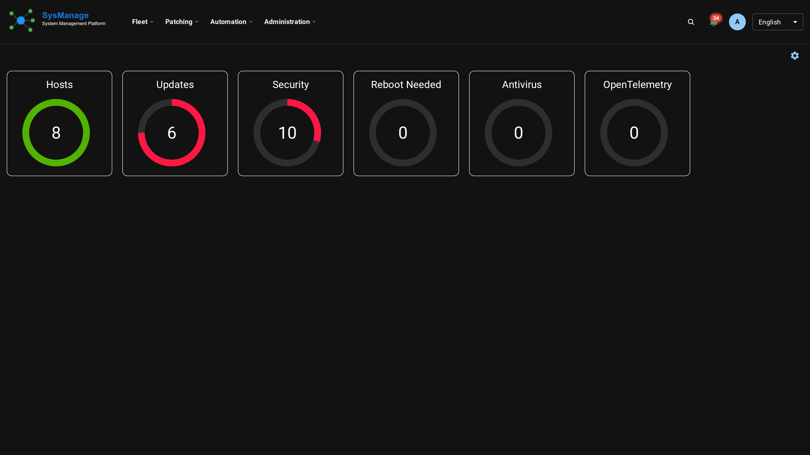
**Unified fleet dashboard.** The entire estate in one view (Windows, Linux, macOS, and BSD) with health, inventory, and status in a single model. *Why it matters: one place to answer "what do we run, and what state is it in?"*

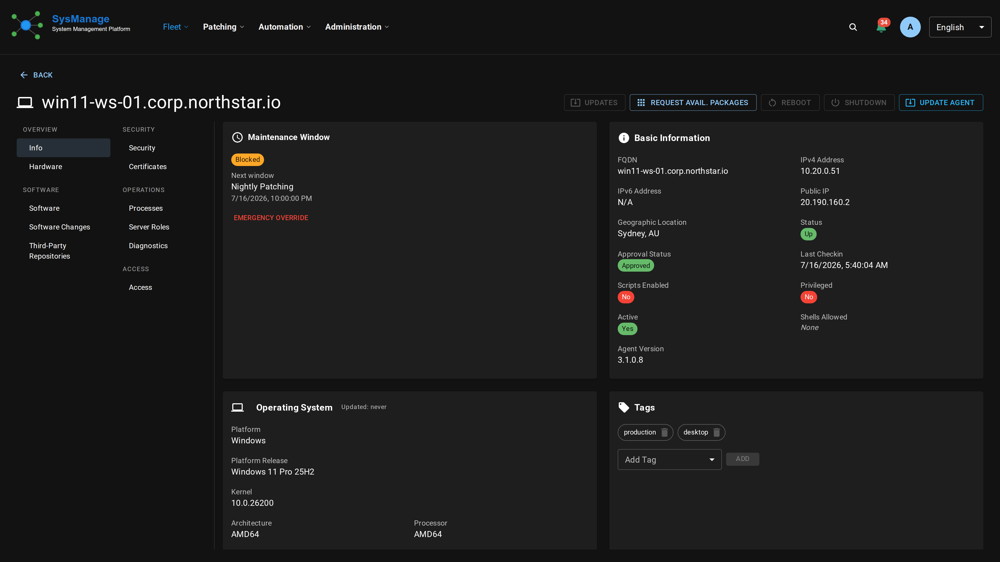
**Host detail.** Deep per-system inventory, installed software, and available updates, presented identically regardless of platform. *Why it matters: administrators learn one interface, not six.*

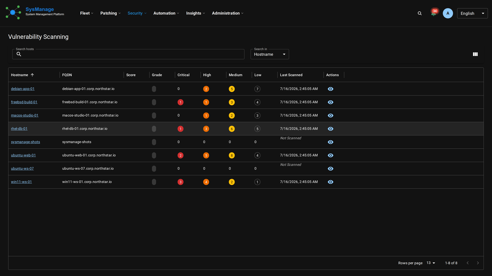
**Vulnerability & vendor-advisory management.** Consolidated visibility into exposure and vendor advisories across the fleet. *Why it matters: one risk picture rather than a separate scanner per operating system.*

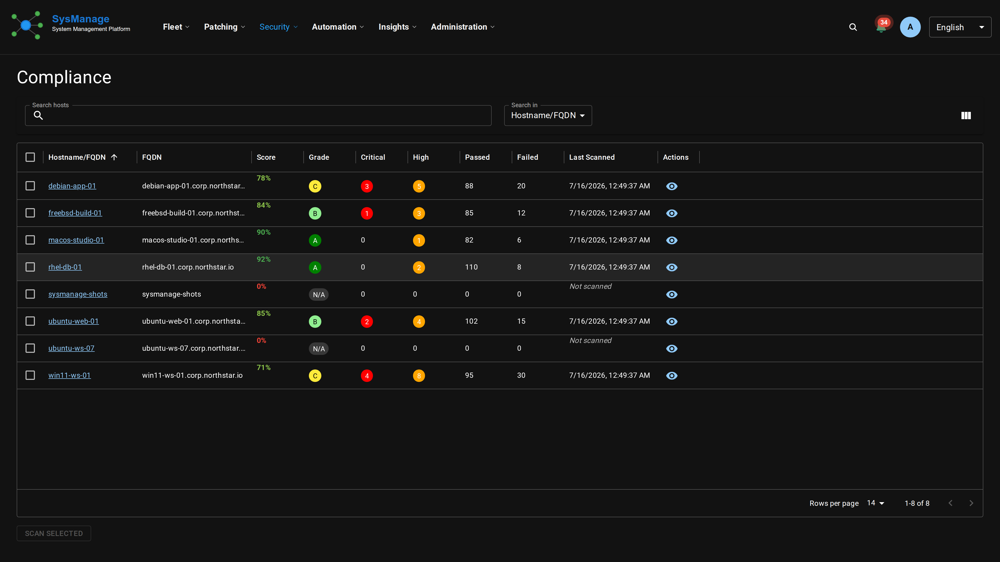
**Compliance assessment & reporting.** Assessments and exportable reports that treat the fleet as one environment. *Why it matters: audit-ready reporting that does not stop at the OS boundary.*

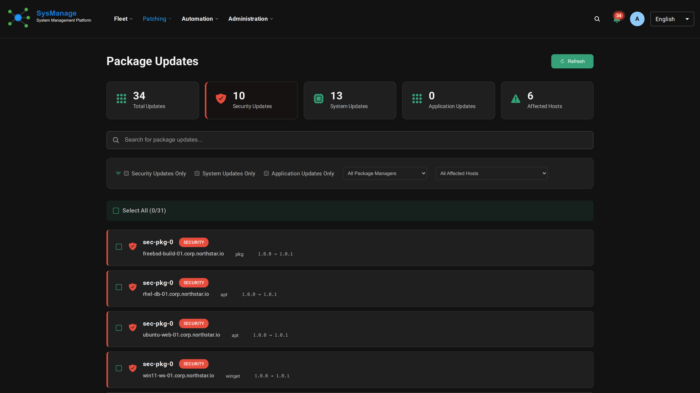
**Patch & update orchestration.** Coordinated updates across platforms, with a record of what changed and who approved it. *Why it matters: faster remediation with a defensible audit trail.*

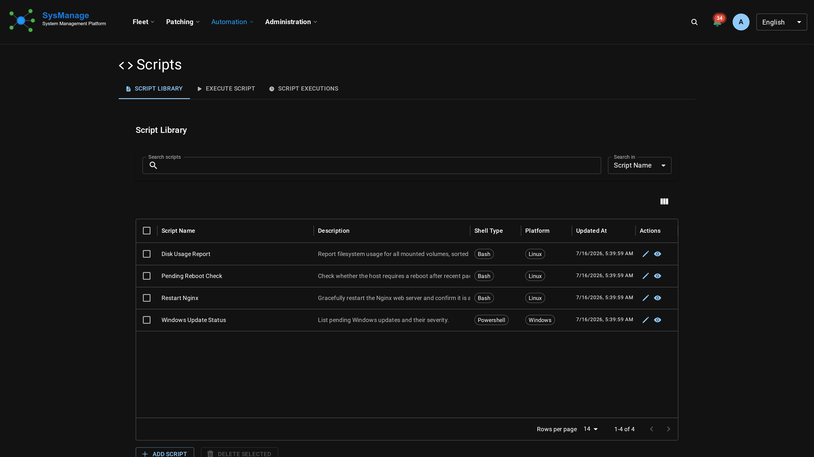
**Automation.** Repeatable operational actions that run across the heterogeneous fleet. *Why it matters: a larger estate without a larger team.*

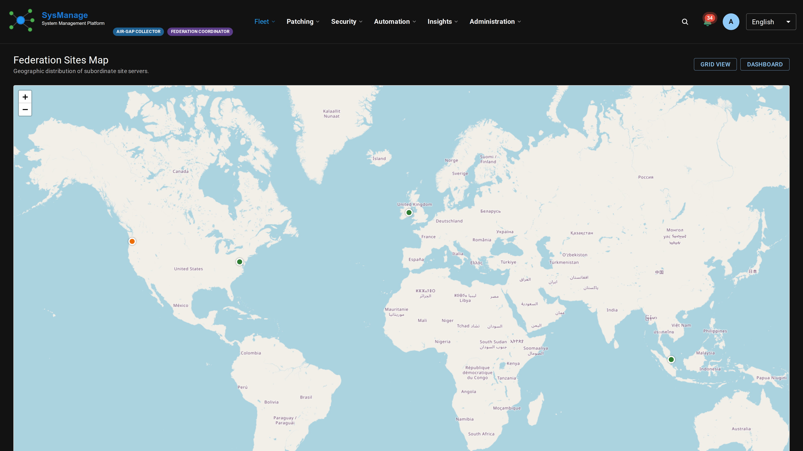
**Multi-tenant administration.** Isolated per-customer or per-business-unit environments under one roof. *Why it matters: purpose-built for MSPs and distributed enterprises.*

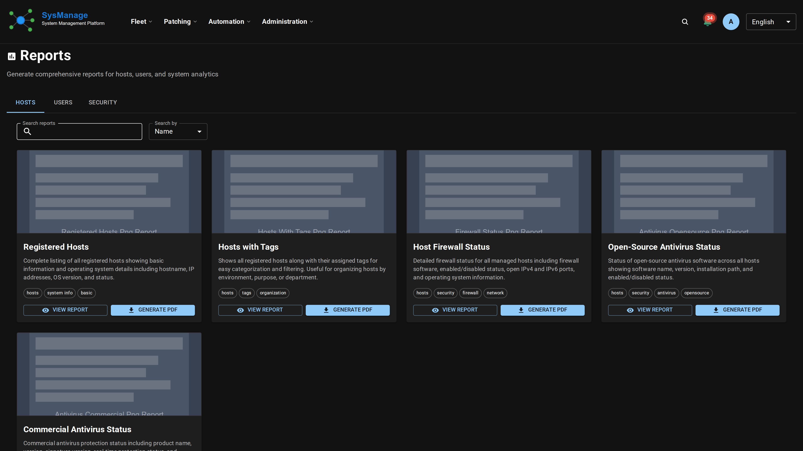
**Reporting.** Operational and executive-level reporting for stakeholders beyond the operations team. *Why it matters: leadership receives the posture without anyone assembling it by hand.*

<!-- PAGEBREAK -->

## Why the Architecture Matters

The technical detail is covered in Appendix A. For the business, three architectural choices are the ones that open markets:

- **Enterprise SaaS and multi-tenancy.** Each tenant is provisioned with its own isolated database, which is what makes the MSP channel and multi-business-unit enterprises possible.
- **Air-gapped deployment.** The platform runs in classified, critical-infrastructure, and disconnected sites that most competitors cannot reach.
- **Isolation and security model.** Cryptographic separation suitable for regulated industries and government buyers.

None of these is easy to retrofit into a product designed around a single operating system, which is a significant part of why the position is defensible.

## Commercialization Strategy

The plan sequences relationships before scale. SysManage follows a proven open-core model: a free Community Edition earns adoption and trust, while the Professional, Enterprise, and Enterprise SaaS tiers monetize the operational, security, and multi-tenant capabilities organizations depend on. Edition detail appears in Appendix B.

- **Phase 1 — Design partners (current focus).** A small set of engaged organizations across different environments, to shape the roadmap and validate real deployments.
- **Phase 2 — Enterprise customers.** Organizations running heterogeneous infrastructure that want consolidation, security, and automation.
- **Phase 3 — Managed Service Providers.** MSPs and MSSPs, whose customer environments are heterogeneous by default. Enterprise SaaS was built for this model.
- **Phase 4 — Channel and technology partners.** Systems integrators, security consultancies, and resellers for reach and delivery; identity, SIEM, cloud, and DevOps integrations for stickiness.
- **Phase 5 — International expansion.** The fourteen-language localization is already in place, so this becomes available when the company is ready for it.

<!-- PAGEBREAK -->

## Market Validation

The opportunity has already been reviewed by an established European venture capital firm founded by experienced enterprise software executives. Their assessment of both the technology and the market was positive. Their principal recommendation was not to change the product, but to strengthen the commercial organization and bring in an experienced enterprise sales leader capable of accelerating adoption.

That is the signal a company wants at this stage. The hard, differentiated part, the technology, exists and works today. External feedback keeps landing on execution rather than direction.

> **Built for a global market from day one.** SysManage's interface and documentation already ship in fourteen languages, allowing customers and partners well beyond North America to adopt the platform without a future localization effort.

This is not a concept awaiting a first build. It is working software today, with an open-source Community Edition and comprehensive documentation.

## Why SysManage Wins

Beyond the product itself, four structural factors give the company a genuine chance to become durable:

1. **Founder–market fit.** The founder has spent three decades operating this exact problem at scale, rather than encountering it recently (see Founder, next page).
2. **Timing.** Fleets keep growing more heterogeneous, security keeps becoming operational, teams keep shrinking, and AI keeps rewarding unified data. Every trend points toward a control plane of this kind.
3. **A defensible moat.** First-class multi-OS support (including BSD), tenant isolation, and air-gapped deployment are difficult to retrofit into a single-OS incumbent. That is a barrier, not a feature.
4. **Open-core adoption.** A free edition builds trust and a bottom-up adoption funnel, which lowers customer-acquisition cost ahead of commercial conversion.

<!-- PAGEBREAK -->

## Founder

SysManage began with a problem I kept encountering, not a technology I set out to build.

At Cox Automotive I was responsible for a large and highly heterogeneous infrastructure: Windows, multiple Linux distributions, macOS, and a range of specialized systems spread across a sprawling estate. Answering a single operational question — what is installed, what is vulnerable, what changed, what is out of compliance — meant moving between separate consoles, each built for one operating system and blind to the others. Individually the tools were capable. Together they were incoherent. I saw the same pattern at organization after organization across three decades.

SysManage is the platform I wished existed every one of those times.

<!-- NO-TM-START -->

I have spent more than three decades building, operating, and leading enterprise software and infrastructure organizations, including Canonical, Cummins, Aprimo, ExactTarget, Epsilon, Emerald Cloud Lab, and Cox Automotive, in roles spanning enterprise software, cloud infrastructure, systems management, and cybersecurity. In 2000 I founded PeopleStrategy, an enterprise human-resources SaaS company, as an early bet on software-as-a-service well before it became the default model. I have participated in multiple public-company IPOs and have worked both the buy and sell sides of billion-dollar-plus mergers and acquisitions. I hold a Master's degree in Information and Cybersecurity from the University of California, Berkeley.

<!-- NO-TM-END -->

The point is not the résumé. It is that I have operated heterogeneous infrastructure at scale, built and sold enterprise software, and understand what CIOs, operators, and investors weigh when they make decisions.

> *"After three decades running enterprise infrastructure, I finally built the platform I always wished existed: the tool I wanted every time someone handed me a fleet and a drawer full of disconnected consoles to run it with."*

<!-- PAGEBREAK -->

## Product Vision & Roadmap

The current platform establishes the foundation. Over the next 18 to 24 months, development expands it along a few consistent lines:

- **AI-assisted operations.** Identifying anomalies, recommending remediation, generating automation, and summarizing the health of the fleet against a single unified model.
- **Enterprise reporting.** Executive dashboards and scorecards suitable for board-level review.
- **Broader integration.** Additional APIs and partnerships across identity, security, cloud, and DevOps.
- **Deployment maturity.** Growing the cloud-native and multi-tenant offering while preserving the customer-managed, on-premises, and air-gapped options that some buyers require.

One principle holds throughout: the objective is not to manage individual systems, but to serve as the control plane for the entire heterogeneous fleet.

## Risks & Mitigation

Building a company in a mature market carries real risks. Naming them, and stating how each is addressed, is part of how experienced operators build companies.

| Risk | Mitigation |
|---|---|
| **Commercial execution** — the product is strong, but the company needs go-to-market leadership. | The top priority is recruiting an experienced enterprise sales leader, which is precisely what the external VC review recommended. |
| **Brand recognition** — a new entrant against known incumbents. | Open-core adoption, genuine multi-OS and BSD support, and design-partner references build credibility from the ground up rather than through advertising spend. |
| **Large incumbents** could extend cross-platform support. | Their single-OS focus and business-model gravity make first-class heterogeneous support difficult to retrofit, and the segments SysManage leads with (BSD, air-gapped, true multi-OS) are the ones they have least reason to prioritize. |
| **Talent and hiring** — building an enterprise go-to-market team is competitive. | A credible founder, working software, and a clear thesis are the strongest recruiting assets a young company can offer. |
| **Capital** — scaling go-to-market may require outside investment. | The open-core, low-burn model preserves optionality, allowing the company to grow deliberately and raise on favorable terms rather than out of necessity. |

Naming these risks is deliberate. A clear-eyed account of what has to go right is a feature of a serious plan, not a weakness in one.

## Current Priorities — The Ask

At this stage the objective is not simply to acquire customers; it is to build the relationships needed to establish a durable enterprise software company. I am currently seeking:

- **Design partners** willing to influence the roadmap.
- **Early enterprise customers** running heterogeneous infrastructure.
- **Technology alliances** across identity, security, cloud, and DevOps.
- **MSP and cybersecurity channel partners.**
- **An experienced enterprise software sales leader** to build the commercial organization.
- **Investors** with a background in enterprise infrastructure and cybersecurity.

If this resonates, or if someone in your network comes to mind, I would welcome an introduction and a brief initial conversation.

## Closing

Enterprise infrastructure will only continue to become more diverse, more distributed, and more security-sensitive. The software used to manage it has largely evolved in silos. SysManage represents an opportunity to rethink systems management around the infrastructure itself rather than around one operating system at a time.

The vision is a single line: one control plane for a heterogeneous fleet.

<!-- PAGEBREAK -->

## Appendix A — Reference Architecture

The design is intentionally straightforward.

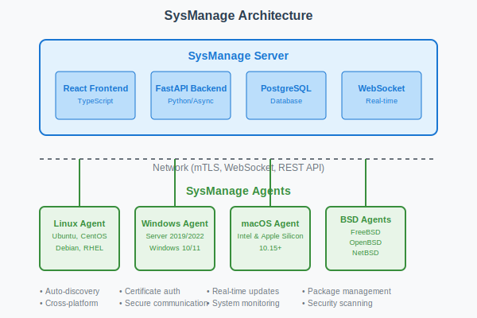

Every managed endpoint runs a lightweight native agent appropriate for its operating system. Agents communicate with the platform over mutually authenticated TLS. Operational data (inventory, software, vulnerabilities, compliance posture, configuration state, and administrative actions) is normalized into one consistent data model that is independent of the underlying operating system. Administrators work in a single web interface whether the endpoint is Windows, Linux, macOS, FreeBSD, OpenBSD, or NetBSD.

Enterprise SaaS extends this with strong tenant isolation. Rather than shared tables keyed by a tenant identifier, each tenant is provisioned with its own PostgreSQL database. Short-lived credentials are brokered through OpenBAO, minimizing long-lived secrets while keeping every tenant cryptographically and operationally isolated. The same architecture supports Enterprise SaaS, MSP delivery, regulated industries, government, customer-owned installations, air-gapped sites, and hybrid cloud, scaling without sacrificing separation or deployment flexibility.

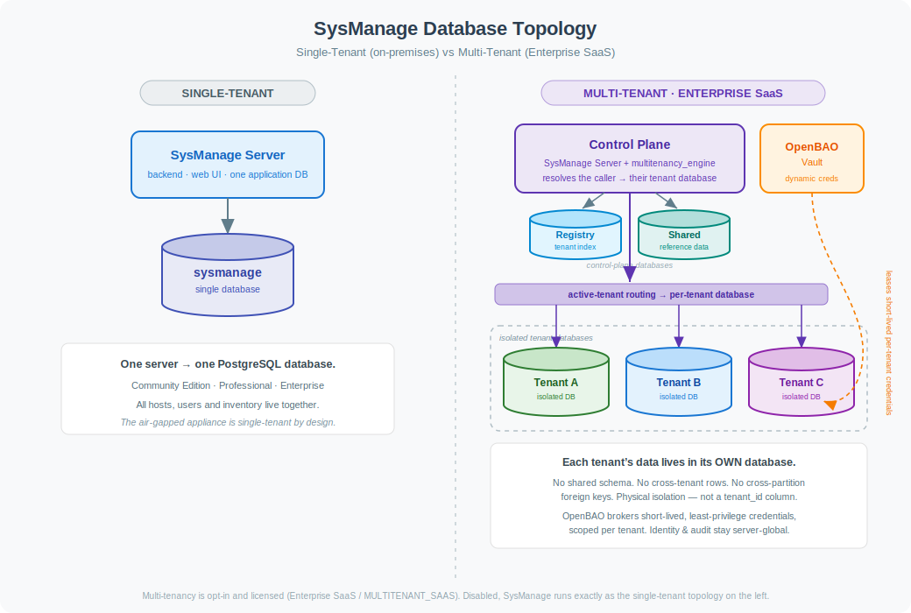

<!-- PAGEBREAK -->

## Appendix B — Product Editions

SysManage follows an open-core model. Pricing is intentionally omitted from this document; the table below describes what each edition is for and what it adds.

| Edition | For whom | What it adds |
|---|---|---|
| **Community** (open source) | Individuals, evaluators, and small teams | Core cross-platform management: inventory, updates, and unified administration across all six operating systems |
| **Professional** | Teams that want AI-assisted operations | AI-assisted operational capabilities and enhanced monitoring |
| **Enterprise** | Larger and regulated organizations | Vulnerability and vendor-advisory management, compliance assessment and reporting, automation, identity integration, secrets management, firewall orchestration, audit/SIEM integration, multi-site federation, and enterprise support |
| **Enterprise SaaS** | MSPs and distributed enterprises | Hosted, multi-tenant architecture with per-tenant database isolation |

The full capability set spans operational, security, compliance, and lifecycle management. The edition determines which of those capabilities a customer receives, and how the platform is operated and supported.

<!-- PAGEBREAK -->

## References

Market-sizing figures in this document are drawn from publicly accessible analyst and market-research summaries. They are presented individually and should not be summed into a single total addressable market. Refresh against the latest published reports before external distribution.

- Enterprise Governance, Risk & Compliance (eGRC) — Grand View Research: <https://www.grandviewresearch.com/industry-analysis/enterprise-governance-risk-compliance-egrc-market>
- IT Operations Management — Mordor Intelligence: <https://www.mordorintelligence.com/industry-reports/it-operations-management-market>
- IT Operations Analytics — Fortune Business Insights: <https://www.fortunebusinessinsights.com/it-operations-analytics-market-109837>
- IT Service Management (ITSM) — Fortune Business Insights: <https://www.fortunebusinessinsights.com/itsm-market-109485>
- Security & Vulnerability Management — MarketsandMarkets: <https://www.marketsandmarkets.com/Market-Reports/security-vulnerability-management-market-204180861.html>
- Unified Endpoint Management — Grand View Research: <https://www.grandviewresearch.com/industry-analysis/unified-endpoint-management-market>
- Unified Endpoint Management (2033 view) — Custom Market Insights: <https://www.custommarketinsights.com/report/unified-endpoint-management-market/>
- Configuration Management & Infrastructure Automation — Virtue Market Research: <https://virtuemarketresearch.com/report/configuration-management-infrastructure-automation-market>
- Patch Management — Polaris Market Research: <https://www.polarismarketresearch.com/industry-analysis/patch-management-market>
- Patch Management — Research and Markets: <https://www.researchandmarkets.com/report/patch-management>
- Managed Services — Grand View Research: <https://www.grandviewresearch.com/industry-analysis/managed-services-market>

<!-- PAGEBREAK -->

## Trademarks & Legal Notice

This document and its contents are confidential and proprietary. © 2026 Bryan Everly. All rights reserved. No part of this document may be reproduced or distributed without permission.

SysManage and the SysManage logo are trademarks of Bryan Everly.

All other product names, company names, brands, logos, service marks, and trademarks referenced in this document are the property of their respective owners and are used solely for identification and comparative-commentary purposes. Their use does not imply any affiliation with, endorsement by, or sponsorship by their respective owners.

Marks referenced in this document include, without limitation: Microsoft, Windows, Intune, and Configuration Manager (Microsoft Corporation); Apple and macOS (Apple Inc.); Jamf (Jamf Software, LLC); Red Hat, Red Hat Enterprise Linux, RHEL, Red Hat Satellite, and Ansible (Red Hat, Inc.); Ubuntu, Canonical, and Landscape (Canonical Ltd.); SUSE and SUSE Manager (SUSE LLC); Linux (Linus Torvalds); FreeBSD (The FreeBSD Foundation); NetBSD (The NetBSD Foundation); OpenBSD (Theo de Raadt and the OpenBSD project); PostgreSQL (The PostgreSQL Global Development Group); OpenBAO (a project of the Linux Foundation); Tanium (Tanium Inc.); BigFix (HCL Technologies Ltd.); NinjaOne (NinjaOne, LLC); ConnectWise (ConnectWise, LLC); Datto and Datto RMM (Datto, Inc.); Automox (Automox, Inc.); Action1 (Action1 Corporation); Qualys (Qualys, Inc.); Rapid7 (Rapid7, Inc.); Tenable (Tenable, Inc.); and Grand View Research, Fortune Business Insights, MarketsandMarkets, Mordor Intelligence, Virtue Market Research, Polaris Market Research, Research and Markets, and Custom Market Insights (their respective owners).

The ® and ™ symbols denote marks claimed by their respective owners. The absence of a symbol in any reference should not be construed as a waiver of any trademark or other intellectual-property rights.

*SysManage — https://sysmanage.org*
